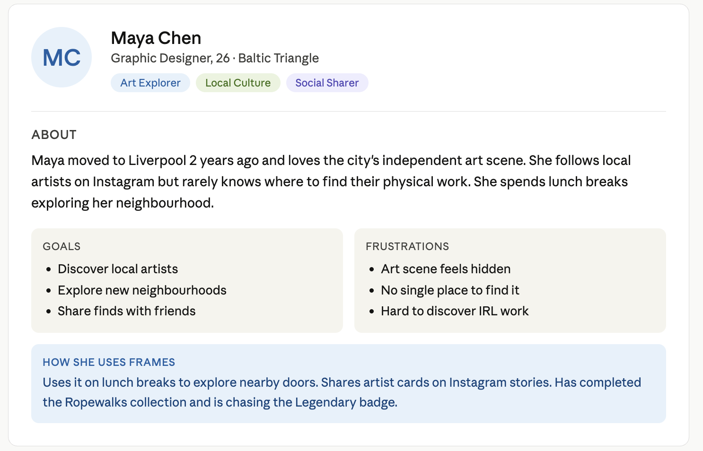
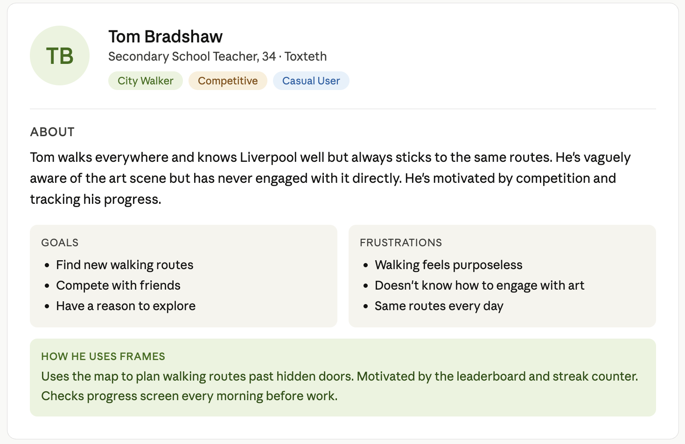
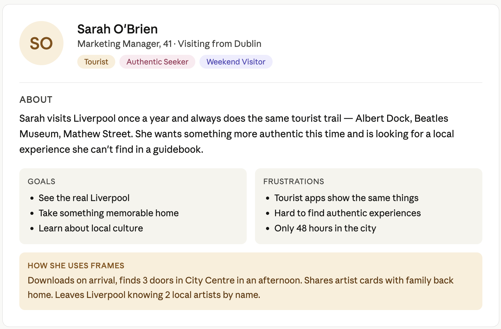

# Frames 🚪

> Discover Liverpool's hidden artists through its iconic doors.

[](https://flutter.dev)
[](https://firebase.google.com)
[](LICENSE)

Frames is a Flutter mobile app that turns Liverpool's streets into an art gallery. Walk to historic doors across the city, scan QR codes to unlock artist profiles, collect door stickers by neighbourhood, earn badges, and compete with friends.

---

## 📱 Application

- [GitHub Repository](https://github.com/yussr19/casa0015-mobile-assessment-frames)
- [Landing Page](https://yussr19.github.io/casa0015-mobile-assessment-frames)
- [Release Build v1.0.0](https://github.com/yussr19/casa0015-mobile-assessment-frames/releases/tag/v1.0.0)
- [Presentation Video](https://www.youtube.com/watch?v=XQgXkHk37Ds)

---

## 📝 Introduction

Liverpool has a thriving independent art scene, but most people walk past its artists every day without knowing they exist. Frames bridges the gap between the city's physical architecture and its creative community — using doors as portals to the artists who call Liverpool home.

The app solves three problems within Connected Environments: Liverpool's hidden architectural heritage goes unnoticed, existing city apps deliver passive information rather than active exploration, and local artists have no platform connecting their work to the physical places that inspire them.

---

## 👤 User Personas





---

## 🎬 Storyboard

The initial designs and layout were sketched out on paper before being developed further.

<p align="center">
  
  
  
</p>

The sketches were then developed further into Figma wireframes to explore the user journey:


---

## ✨ Main Features

- **Geocaching Map** — Radar-style Google Maps with 9 hidden doors across Liverpool. Orange = found, Blue = undiscovered, Yellow = door of the week
- **QR Scanner** — Scan door codes to unlock artist profiles with spark animation and haptic feedback
- **Artist Cards** — Flip animation reveals artist bio, artwork, rarity rating and share button
- **Sticker Collection** — Door stickers organised by neighbourhood with completion badges
- **Rarity System** — Common (10pts), Rare (25pts) and Legendary (50pts) doors
- **Badges & Achievements** — 9 unlockable badges with Liverpool landmark illustrations including Cathedral and Liver Building
- **Proximity Alert** — Radar pulses gold when within 100m of an undiscovered door
- **Door of the Week** — Featured door highlighted in yellow on the map each week
- **First Finder Badge** — Special popup for the first user ever to scan each door
- **Leaderboard** — Live rankings updated in real time via Firebase
- **Cryptic Hints** — Poetic location clues for undiscovered doors instead of GPS arrows
- **Door Nominations** — Users can nominate new doors and suggest artists

---

## 🗺️ Neighbourhoods

| Neighbourhood | Doors | Rarity |
|---|---|---|
| City Centre | 3 | Common & Rare |
| Ropewalks | 5 | Rare & Legendary |
| Baltic Triangle | 1 | Legendary |

---

## 🏗️ Architecture

The app uses a four-layer architecture:

| Layer | Technology |
|---|---|
| UI Layer | Flutter Widgets (Dart) |
| Service Layer | Firebase Auth, Firestore, Storage |
| API Layer | Google Maps, Geocoding, mobile_scanner |
| Sensor Layer | GPS / Geolocator, Camera, Haptics |

---

## 📦 Dependencies and APIs

| Package | Purpose |
|---|---|
| google_maps_flutter | Interactive map with custom markers |
| mobile_scanner | QR code scanning (simulator compatible) |
| firebase_core / auth / firestore / storage | Backend and real-time data |
| geolocator | GPS location for proximity detection |
| share_plus | Share artist cards to social media |
| google_fonts | Typography |
| flutter_launcher_icons | App icon generation |

---

## 🚀 Release Build

| Platform | Status | Details |
|---|---|---|
| Android | ✅ Built | app-release.apk (95.2MB) — [Download](https://github.com/yussr19/casa0015-mobile-assessment-frames/releases/tag/v1.0.0) |
| iOS | ✅ Built | Runner.xcarchive (490MB) via flutter build ipa --release |

```bash
# Android
flutter build apk --release

# iOS
flutter build ipa --release --no-codesign
```

---

## 💻 Development Environment

- Flutter SDK: 3.0+
- Dart SDK: 3.0+
- iOS 16+ / Android 10+
- VS Code or Android Studio
- Firebase project (Blaze plan for Storage)

---

## 📱 Getting Started

### For Users

1. Download the APK from the [Releases page](https://github.com/yussr19/casa0015-mobile-assessment-frames/releases/tag/v1.0.0)
2. Open the app and tap the door knocker to enter
3. Allow location permissions
4. Walk to a door in Liverpool and scan its QR code
5. Collect all 9 artist cards!

### For Developers

1. Clone the repository:
```bash
git clone https://github.com/yussr19/casa0015-mobile-assessment-frames.git
cd casa0015-mobile-assessment-frames
```

2. Install dependencies:
```bash
flutter pub get
```

3. Add your `GoogleService-Info.plist` (iOS) to `ios/Runner/`
4. Add your `google-services.json` (Android) to `android/app/`
5. Add your Google Maps API key to `android/app/src/main/AndroidManifest.xml`

6. Run the app:
```bash
flutter run
```

---

## 📞 Contact

- **Student:** Yussr Osman
- **Module:** CASA0015 Mobile Systems & Interactions
- **Institution:** UCL Connected Environments
- **Year:** 2026

---

## 📄 License

This project is licensed under the MIT License.
